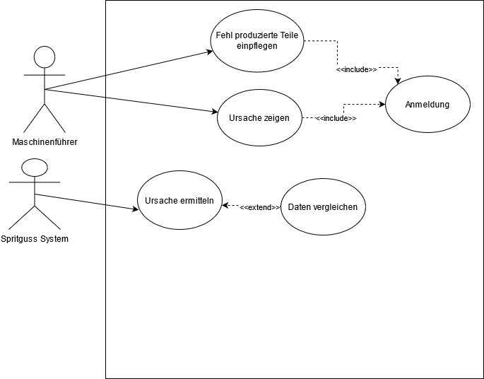
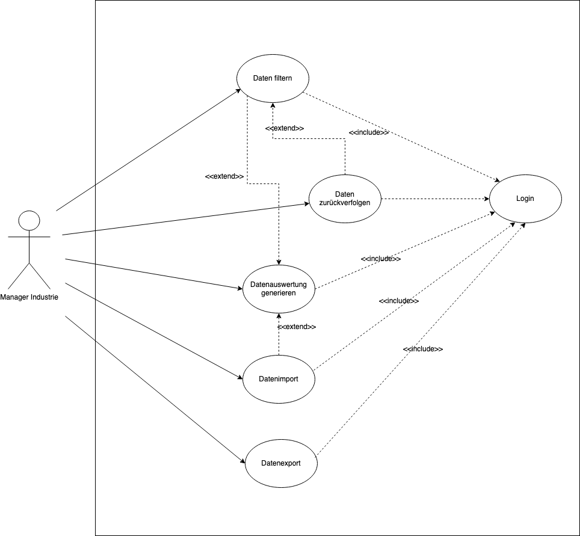
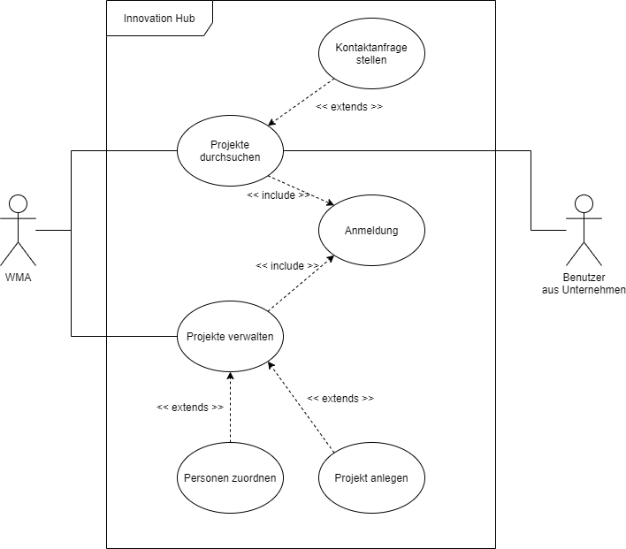

# 7. Use Cases

##  7.1 Use Case Diagramme

Extrahiert die Use Cases aus euren Szenarien und Funktionalen Anforderungen und erstellt ein Use-Case Diagramm.

Bitte fügt über das Diagramm folgende Tabelle ein

| DiagrammID  | Quellen |
| ----------- | ------- |
| UCD-0< TeamNr > | < Szenario IDs > |

### 7.1.1 Team 1
| DiagrammID  | Quellen |
| ----------- | ------- |
| UCD-01 |[SZ-0103](https://github.com/pschm/am-lastenheft-ss20/blob/master/lastenheft/02.-persona-und-szenarien.md#SZ-0103) |

   

### 7.1.2  Team 2
| DiagrammID  | Quellen |
| ----------- | ------- |
| <a name="UCD-02">UCD-02</a> |[SZ-0202](https://github.com/pschm/am-lastenheft-ss20/blob/master/lastenheft/02.-persona-und-szenarien.md#SZ-0202) |

### 7.1.3 Team 4

### 7.1.4 Team 5

| DiagrammID  | Quellen |
| ----------- | ------- |
| UCD-05 |[SZ-0503](https://github.com/pschm/am-lastenheft-ss20/blob/master/lastenheft/02.-persona-und-szenarien.md#SZ-0503) |

### 7.1.5 Team 6
| DiagrammID  | Quellen |
| ----------- | ------- |
| UCD-06 | [SZ-0601](../lastenheft/02.-persona-und-szenarien.md#237-team-6) |

   
    
### 7.1.6 Team 7
| DiagrammID  | Quellen |
| ----------- | ------- |
| UCD-07 |[SZ-0702](https://github.com/pschm/am-lastenheft-ss20/blob/master/lastenheft/02.-persona-und-szenarien.md#238-team-7) |

### 7.1.7 Team 8
| DiagrammID  | Quellen |
| ----------- | ------- |
| <a name="UCD-08">UCD-08</a> |[SZ-1105](02.-persona-und-szenarien.md#SZ-1105) |

## 7.2 Use Case - Spezifikation 

### Template

Schreibt für einen eurer Use Cases die Spezifikation.

Bitte kopiert das Template und füllt die Felder dementsprechend aus. Felder die nach einem bestimmten Pattern ausgefüllt werden sollen, sind in dem Template entsprechend definiert.

| Abschnitt | Inhalt |
|---|---|
| Bezeichner  | UCS-0< TeamNr >0< Use Case Nummer >   |
| Name | Name des Use Cases|
| Autoren  | TeamNr.  |
| Kritikalität |   |
| Beschreibung  | Kurze beschreibung  |
| Quellen | Quellids |
| Auslösendes Ereignis  |   |
| Vorbedingung  |   |
| Nachbedingung  |   |
| Akteure  |   |
| Ergebnis  |   |
| Hauptszenario  |   |
| Alternativszenarien  |   |
| Ausnahmeszenarien  |   |

### 7.2.1 Team 1

| Abschnitt | Inhalt |
|---|---|
| Bezeichner  | UCS-0101  |
| Name | Gemeinsame Arbeit an den Daten|
| Autoren  | Team 1  |
| Kritikalität | Mittel  |
| Beschreibung  | Die auf die DataPlatform geladenen Daten können zum Zwecke der gemeinsamen Erkenntnisgewinnung von den berechtigten Unternehmen bearbeitet werden. |
| Quellen | [[SZ-0103](../lastenheft/02.-persona-und-szenarien.md#232-team-1)] |
| Auslösendes Ereignis  | Wunsch nach Daten und Wissen über predictive maintenance mit anderen Unternehmen zu teilen |
| Vorbedingung  | Die Daten wurden hochgeladen  |
| Nachbedingung  | |
| Akteure  | Mitarbeiter der Unternehmen  |
| Ergebnis  | Daten wurden für die eventuell weitere Verarbeitung manipuliert und/oder es wurden Erkenntnisse gewonnen |
| Hauptszenario  | 1. Die Unternehmen tauschen ihre Daten untereinander aus  2. Sie vergleichen/bearbeiten die Daten  3. Neue Erkenntnisse zur predictive maintenance |
| Alternativszenarien  | 3a) Die Daten bieten neben Erkenntnissen zu predictive maintenance auch solche abseits davon  3a1) Die Erkenntnisse werden eingesetzt   3b) Die Daten bieten noch nicht genug Informationen, um Erkenntnisse über predictive maintenance zu gewinnen.  3b1) Es wird zu einem späteren Zeitpunkt neuer Versuch mit mehr Daten gestartet. |
| Ausnahmeszenarien  | 2a) Die Daten sind aufgrund Inkompatiblitäten nicht vergleichbar.  |

### 7.2.2  Team 2
Schreibt für einen eurer Use Cases die Spezifikation.

Bitte kopiert das Template und füllt die Felder dementsprechend aus. Felder die nach einem bestimmten Pattern ausgefüllt werden sollen, sind in dem Template entsprechend definiert.

| Abschnitt | Inhalt |
|---|---|
| Bezeichner  | <a name="UCS-0201">UCS-0201</a>   |
| Name | Einbindung eines unternehmensspezifischen Moduls |
| Autoren  | Team 2  |
| Kritikalität | Hoch |
| Beschreibung  | Ein im Unternehmen entwickeltes Modul wird in die Datenplattform eingebunden  |
| Quellen | [SZ-0202](../lastenheft/02.-persona-und-szenarien.md#SZ-0202)|
| Auslösendes Ereignis  | Wunsch die unternehmensinternen Daten automatisiert aufzubereiten |
| Vorbedingung  | Ein Plattform-Entwickler hat lokal ein neues Modul entwickelt  |
| Nachbedingung  | Das Modul wurde erfolgreich auf der Plattform installiert und bereitet Daten fortan automatisiert auf |
| Akteure  | [Platform-Entwickler](../lastenheft/03.-glossar.md#GL-1600) |
| Ergebnis  | Die Plattform bestätigt eine erfolgreiche Installation des Moduls |
| Hauptszenario  | 1. Der [Platform-Entwickler](../lastenheft/03.-glossar.md#GL-1600) loggt sich auf der Datenplattform ein   2. Der [Platform-Entwickler](../lastenheft/03.-glossar.md#GL-1600) lässt sich die unternehmensinternen [Speicherbereiche](../lastenheft/03.-glossar.md#GL-1902) anzeigen   3. Der [Platform-Entwickler](../lastenheft/03.-glossar.md#GL-1600) wählt einen [Speicherbereich](../lastenheft/03.-glossar.md#GL-1902) aus auf dem die Daten abgelegt werden   4. Der [Platform-Entwickler](../lastenheft/03.-glossar.md#GL-1600) lässt sich Informationen zur Verbindung mit dem [Speicherbereich](../lastenheft/03.-glossar.md#GL-1902) ausgeben   5. Der [Platform-Entwickler](../lastenheft/03.-glossar.md#GL-1600) bindet den Datenspeicher in das neue Modul ein   6. Der [Platform-Entwickler](../lastenheft/03.-glossar.md#GL-1600) lädt das fertige Modul hoch   7. Das System führt eine automatische Qualitätskontrolle des Source Codes durch. |
| Alternativszenarien  | 3. Es ist kein geeigneter [Speicherbereich](../lastenheft/03.-glossar.md#GL-1902) vorhanden   3a. Der [Platform-Entwickler](../lastenheft/03.-glossar.md#GL-1600) legt einen neuen [Speicherbereich](../lastenheft/03.-glossar.md#GL-1902) an   3b. Der [Platform-Entwickler](../lastenheft/03.-glossar.md#GL-1600) setzt die benötigten Berechtigungen für den neuen [Speicherbereich](../lastenheft/03.-glossar.md#GL-1902)    7. Das Modul besteht die automatisierte Qualitätsprüfung für Plattform Module nicht   7a. Der [Platform-Entwickler](../lastenheft/03.-glossar.md#GL-1600) passt seinen Quellcode an und lädt die korrigierte Fassung auf das System |
| Ausnahmeszenarien  |   |

### 7.2.3 Team 4

| Abschnitt | Inhalt |
|---|---|
| Bezeichner  | UCS-0401   |
| Name | Störungen auswerten|
| Autoren  | Team 4 |
| Kritikalität | hoch  |
| Beschreibung  | Die aufgetretenen Störungen an Geräten werden ausgewertet. Es wird eine Fehleranalyse durchgeführt. Die Ursache einer Störung wird somit ermittelt.  |
| Quellen | [QU-0104](../lastenheft/09.-quellen.md#QU-0104), [SZ-0403](../lastenheft/02.-persona-und-szenarien.md#SZ-0403) |
| Auslösendes Ereignis  | Instandhaltungsarbeiter möchte herausfinden, wo und warum eine Störung aufgetreten ist.  |
| Vorbedingung  |  Es ist eine Störung aufgetreten. |
| Nachbedingung  | Störungsursache ist ermittelt   |
| Akteure  |  Instandhaltungsarbeiter, System |
| Ergebnis  | Auswertung über die aufgetretenen Störungen und deren Ursachen   |
| Hauptszenario  | 1. Die aufgetretenen Störungen an Geräten werden erfasst und automatisch in das System eingetragen.   2. Der Nutzer startet die Analyse für das Gerät.  3. Die Ursachen der Störung werden analysiert. Dabei werden Störungsdaten für die Fehleranalyse aufgerufen.   4. Die Anzahl einer Störung aus demselben Grund wird ermittelt.   5. Das System zeigt die Auswertung an. |
| Alternativszenarien  | 2a. Es sind keine Störungsdaten für die Analyse vorhanden.  &#8195; 2a1. System fordert auf Daten zu importieren.  &#8195; 2a2. Instandhaltungsarbeiter importiert die  Störungsdaten.|
| Ausnahmeszenarien  | 1a. Die Störungsdaten werden nicht in das System eingetragen.   2b1. Gerät konnte nicht gefunden werden  3a1. Es sind keine Störungsdaten vorhanden.  3a2. Die Auswertungen sind fehlerhaft.|
### 7.2.4 Team 5

| Abschnitt | Inhalt |
|---|---|
| Bezeichner  | UCS-0501  |
| Name | Analyse der fehl produzierten Teile|
| Autoren  | Team 5  |
| Kritikalität | Mittel  |
| Beschreibung  | Die fehl produzierten Teile sollen in das System als Information abgespeichert werden. Dadurch sollen die fehl produzierten Teile nach verfolgbar werden. |
| Quellen | [[SZ-0503](../lastenheft/02.-persona-und-szenarien.md#236-team-5)] |
| Auslösendes Ereignis  | Wunsch nach Anomalieerkennung |
| Vorbedingung  | Fehl produzierte Teile  |
| Nachbedingung  | - |
| Akteure  | Mitarbeiter der Unternehmen  |
| Ergebnis  | Die fehl produzierten Teile wurden analysiert und als Anomalierkennung benutzt. Dadurch wurde die Ursache schneller gefunden. |
| Hauptszenario  | 1. Der Maschinenführer trägt die fehl produzierten Teile in das System ein.   2. Mithilfe der Anomalieerkennung findet das System die Ursache.  3. Der Maschinenführer behebt den Fehler anhand der Information der Anomalieerkennung. |
| Alternativszenarien  | 2a) Ein Mitarbeiter mit langjähriger Erfahrung findet die Ursache.   3a) Der Maschinenführer behebt den Fehler anhand der Information der Mitarbeiter.|
| Ausnahmeszenarien  | 2a) Das System zeigt eine inkorrekte Ursache an.  |

### 7.2.5 Team 6

| Abschnitt | Inhalt |
|---|---|
| Bezeichner  | UCS-0601  |
| Name | Evaluation der Artefakte|
| Autoren  | Team 6  |
| Kritikalität | Gering  |
| Beschreibung  | Nach der Bearbeitung der Aufgaben treffen sich alle involvierten Parteien, um die erstellten Artefakte zu diskutieren und zu bewerten.|
| Quellen | [[QU-0106](../lastenheft/09.-quellen.md#QU-0106)], [[SZ-0601](../lastenheft/02.-persona-und-szenarien.md#237-team-6)] |
| Auslösendes Ereignis  | Die Deadline wurde erreicht   |
| Vorbedingung  | Die Aufgaben wurden bearbeitet  |
| Nachbedingung  | |
| Akteure  | Professor und Studierende  |
| Ergebnis  | Die Artefakte wurden im Gesamteam evaluiert |
| Hauptszenario  | 1. Die involvierten Parteien treffen sich. 2. Die Studierenden präsentieren ihre Ergebnisse. 3. Die Ergebnisse werden im Plenum gemeinsam mit dem Professor diskutiert. 4. Die Artefakte wurden erfolgreich evaluiert. |
| Alternativszenarien  | 3a) Die Ergebnisse sind nicht zufriedenstellend und müssen überarbeitet werden. 3a1) Die Ergebnisse werden erneut überarbeitet. 3a2) Die Ergebnisse werden erneut im Plenum diskutiert. 3a3) Die Artefakte wurden erfolgreich evaluiert. |
| Ausnahmeszenarien  |   |

### 7.2.6 Team 7
| Abschnitt | Inhalt |
|---|---|
| Bezeichner  | UCS-0701   |
| Name | Datenauswertung generieren|
| Autoren  | Team 7 |
| Kritikalität | Hoch   Wenn keine Auswertung generiert werden kann, können viele Stakeholderziele nicht erreicht werden    |
| Beschreibung  | Die in der Data Platform gehaltenen Maschinendaten werden Algorithmisch ausgewertet. Es wird ein Report generiert, der Auffälligkeiten anzeigt  |
| Quellen | [[QU-0107]](../lastenheft/09.-quellen.md#QU-0107)], [[SZ-0702]](https://github.com/pschm/am-lastenheft-ss20/blob/master/lastenheft/02.-persona-und-szenarien.md#238-team-7) |
| Auslösendes Ereignis  | Nutzer möchte eine Datenauswertung generieren  |
| Vorbedingung  |  Nutzer ist eingelogt  |
| Nachbedingung  |  Daten wurden analysiert |
| Akteure  | Nutzer, System  |
| Ergebnis  |  Report über die analysierten Daten |
| Hauptszenario  | 1. Nutzer wählt das Datenanalyse Tool aus 2. System präsentiert die verschiedenen Analysealgorithmen und Datensätze  3. Nutzer wählt Algorithmus und Datensatz aus   4. System Zeigt weitere Optionen zur konfiguration des Algoritmus an   5. Nutzer konfiguriert Algorithmus   6. Nutzer startet Datenauswertung   8. System generiert Auswertung|
| Alternativszenarien  | 2a. Keine Datensätze vorhanden       2a1. System zeigt an, dass keine Datensätze verfügbar sind   2a1. Nutzer importiert Daten  3a. Nutzer will Datensätze anpassen   3a1. Nutzer filtert Datensatz|
| Ausnahmeszenarien  | 2b. Kein Algorithmus konfiguriert   8a. Fehler bei Datenauswertung   8a1. System schreibt Systemstatus ins Log   8a2. System zeigt Fehlermeldung an  |

### 7.2.7 Team 8
| Abschnitt | Inhalt |
|---|---|
| Bezeichner | <a name="UCS-0801">UCS-0801</a> |
| Name | Projekte durchsuchen |
| Autoren | Team 8 |
| Kritikalität | Durchsuchung der Projekte im Innovation Hub |
| Beschreibung | Der Benutzer möchte Projekt finden |
| Quellen | [SZ-1105](../lastenheft/02.-persona-und-szenarien.md#SZ-1105) |
| Auslösendes Ereignis | Der Benutzer möchte Projekt finden |
| Vorbedingung | Benutzer ist angemeldet |
| Nachbedingung | Benutzer erhält Suchergebnisse |
| Akteure | Benutzer, Innovation Hub |
| Ergebnis | Projektsuche |
| Hauptszenario | 1. Der Benutzer gibt die Suchbegriffe ein. 2. Das System durchsucht die Projekt-Datenbank. 3. Das System listet die Suchergebnisse auf. |
| Alternativszenarien | - |
| Ausnahmeszenarien | 1a. Der Nutzer bricht die Suche ab. 2a. Das System findet keine Ergebnisse. &#8195;2a.1. Das System informiert den Benutzer über die Ergebnisse. &#8195;2a.2. Gleichzeitig schlägt das System mögliche Fehlerursachen vor.|

## 7.3 Aktivitätsdiagramme

Erstellt für eure Spezifikation ein Aktivitätsdiagramm. 

Bitte fügt über das Diagramm folgende Tabelle ein

| DiagrammID  | Quellen |
| ----------- | ------- |
| UCA-0< TeamNr >0< Use Case Nummer > | < UC-BEzeichner >|

### 7.3.1 Team 1

| DiagrammID  | Quellen |
| ----------- | ------- |
| UCA-0101 | UCS-0101 |

### 7.3.2  Team 2

| DiagrammID  | Quellen |
| ----------- | ------- |
| <a name="UCA-0201">UCA-0201</a> | [UCS-0201](07.-use-cases.md#UCS-0201) |

### 7.3.3 Team 4

### 7.3.4 Team 5

| DiagrammID  | Quellen |
| ----------- | ------- |
| UCA-0501 | UCS-001 |

### 7.3.5 Team 6

| DiagrammID  | Quellen |
| ----------- | ------- |
| UCA-0601 |Artefakte Evaluieren|

### 7.3.6 Team 7
| DiagrammID  | Quellen |
| ----------- | ------- |
| UCA-0701 | UCS-0701 |

### 7.3.7 Team 8
| DiagrammID  | Quellen |
| ----------- | ------- |
| UCA-0801 | [UCS-0801](07.-use-cases.md#UCS-0801) |

