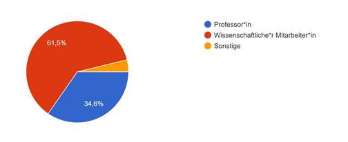
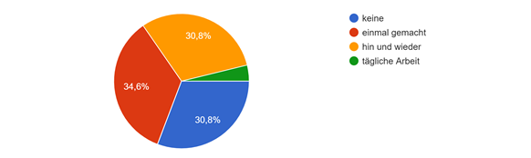
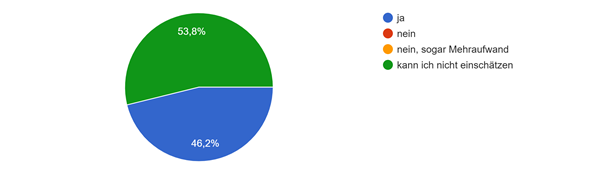
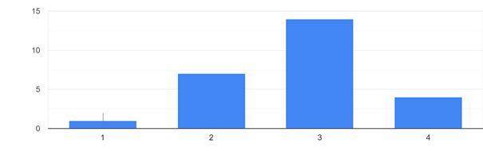
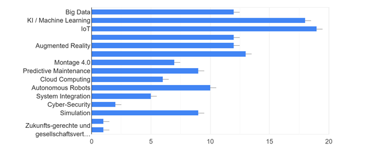
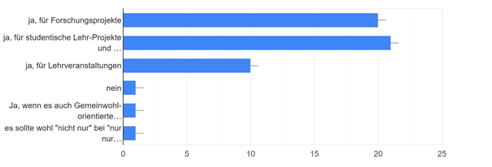
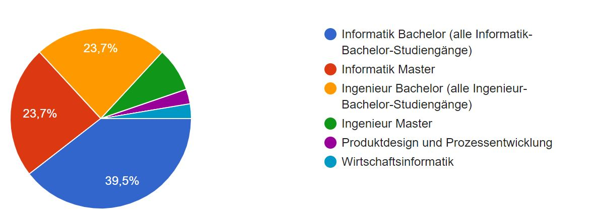

# Quantitative Auswertungen der Fragebögen

## 1 Mitarbeiter der Unternehmen
**Kapitel-ID**: <a name="AN-0411">AN-0411</a>

rot -> Leitende/Strategische Position  
grün -> Verwaltung  
blau -> Entwicklung  
schwarz -> Vertrieb  
türkis -> Industriemeister für Elektrotechnik

rot -> nein  
grün -> ja

## 2 Mitarbeiter/Professoren der TH Köln
**Kapitel-ID**: <a name="AN-0412">AN-0412</a>

##### Relativer Anteil der Befragungsteilnehmer nach Rolle/Titel

##### Häufigkeit der genannten Aufgabengebiete/Schwerpunkte.

##### Relativer Anteil der Personen mit Erfahrung bei der Analyse großer Datenmengen?

##### Relativer Anteil der Personen, welche spezielle Hard- und/oder Software aus dem Breich der Datenanalyse erwarten?

##### Relativer Anteil der Personen, welche das Angebot der Data Platform für Lehrveranstaltungen, Abschlussarbeiten, Lehr- oder Forschungs-Projekte nutzen würden.

##### Relativer Anteil der Personen die sich einen positiven Einfluss der Data Platform auf eigene Module/Projekte vorstellen können.

##### Häufigkeit der Personen, welche bereits Erfahrung im Bereich der Industrie 4.0 gesammelt haben. 
von "noch nie gehört" (0) bis "sehr vertraut" (4)

##### Häufigkeit nach Themengebieten. Teilnehmende Personen können sich zukünftig einen Fokus auf diese Themengebieten vorstellen.

##### Häufigkeit, in welchem Maße sich teilnehmende Personen vorstellen können, die Data Platform als Basis für Kontakt und Kollaboration mit Unternehmen zu nutzen. 

## 3 Studenten der TH Köln
**Kapitel-ID**: <a name="AN-0412">AN-0413</a>

Insgesamt haben 38 Studenten an der Umfrage teilgenommen. 

#### Relativer Anteil der Befragungsteilnehmer nach Studiengang/Schwerpunkt

#### Relativer Anteil der Befragungsteilnehmer nach Semester

#### Relativer Anteil der Befragungsteilnehmer, ob sie nebenbei arbeiten

#### Relativer Anteil der Befragungsteilnehmer, ob sie Erfahrungen/Vorkenntnisse mit Datenanalyse haben

#### Relativer Anteil der Befragungsteilnehmer, ob die Analyse von Daten sie reizen würde

#### Relativer Anteil der Befragungsteilnehmer, welche zusätzlichen beruflichen Qualifikationen sie sich durch das Innovation Hub erhoffen und welche Arten der Kollaboration sie sch mit Unternehmen des Innovation Hub's vorstellen

#### Relativer Anteil der Befragungsteilnehmer nach Interesse an studiengangsübergreifenden Projekten (Informatiker und Ingenieure gemeinsam)

